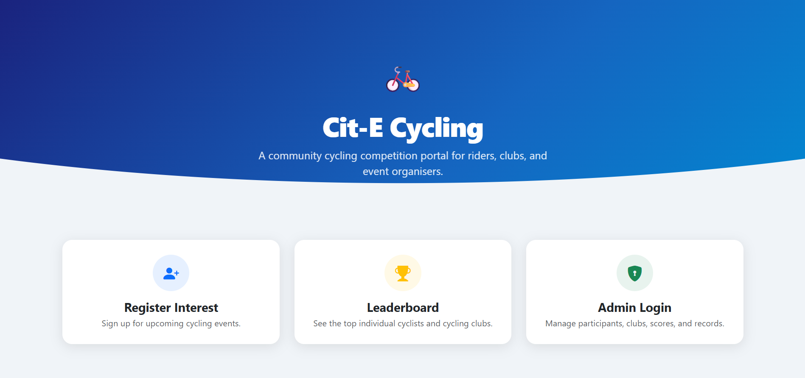
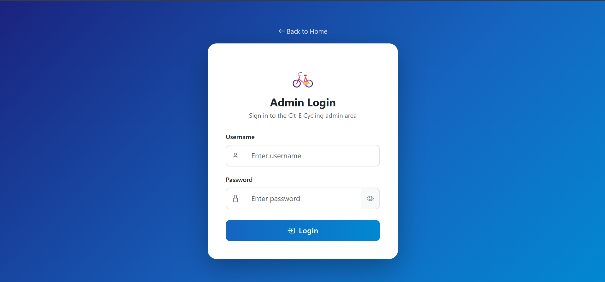
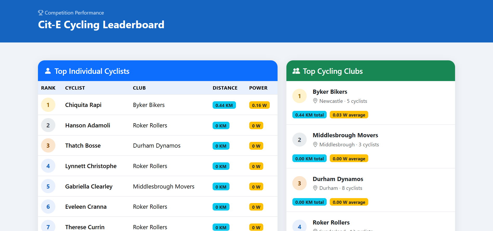

# Cit-E Cycling

A PHP and MySQL web application for managing a national cycling competition. Originally developed as a university assignment, this project was extended into a portfolio-ready admin portal with live performance data, secure participant management, and public leaderboards.

## Features

### Public Area

- Register interest for future cycling events
- Server-side and browser-side registration validation
- Public individual and club leaderboard
- Responsive homepage and mobile-friendly interface

### Admin Area

- Session-protected admin login and logout
- Live dashboard statistics:
  - Total participants
  - Total cycling clubs
  - Total distance travelled
  - Average power output
- Search participants by first name or surname
- Search clubs and view associated participants
- View all participant records
- Update participant distance travelled and power output
- Secure participant deletion with server-side confirmation and CSRF protection

## Security and Validation

- PDO prepared statements for database queries
- Output escaping with `htmlspecialchars()`
- Server-side validation for registration and score updates
- CSRF protection for participant edit and delete actions
- Friendly user-facing database error messages

## Technology Used

- PHP
- MySQL
- HTML5
- CSS3
- Bootstrap 5
- Bootstrap Icons
- XAMPP
- Git and GitHub

## Local Setup

1. Install XAMPP and start Apache and MySQL.
2. Copy the project into the XAMPP `htdocs` folder.
3. Open phpMyAdmin at `http://localhost/phpmyadmin`.
4. Import `cycling.sql` to create the database and sample data.
5. Create your local database configuration:

   ```bash
   cp dbconnect.example.php dbconnect.php
   ```

6. Edit `dbconnect.php` with your local MySQL details.
7. Open the application:

   ```text
   http://localhost/cycling/
   ```

## Demo Admin Login

```text
Username: admin
Password: password123
```

> These credentials are included only for the assignment demo database. A production system should use password hashing and role-based access control.

## Manual Testing Checklist

Before publishing changes, test the following features locally with Apache and MySQL running in XAMPP:

- [ ] Submit the registration form with valid details and accepted terms.
- [ ] Submit the registration form with an invalid email and confirm that a friendly error appears.
- [ ] Log in with the admin demo account.
- [ ] Try opening an admin page while logged out and confirm that the visitor is redirected to the admin login page.
- [ ] Confirm that dashboard statistics show participant, club, distance, and power data.
- [ ] Search for a participant by first name or surname.
- [ ] Search for a club and confirm that its performance summary is displayed.
- [ ] Update a participant's power output and distance, then confirm the changes appear in the participant list and leaderboard.
- [ ] Open the delete confirmation page, test Cancel, then confirm deletion only happens after clicking Delete Permanently.
- [ ] Open the public leaderboard and confirm that individual cyclists and clubs are ranked correctly.

## Future Improvements

- Event scheduling, locations, and time-slot management
- CSV export for participant and club data
- Charts for performance trends
- Participant accounts and personal progress pages
- Password hashing and role-based access control
- Online deployment

## Screenshots

### Homepage



### Admin Dashboard



### Leaderboard



## Author

Sushreet